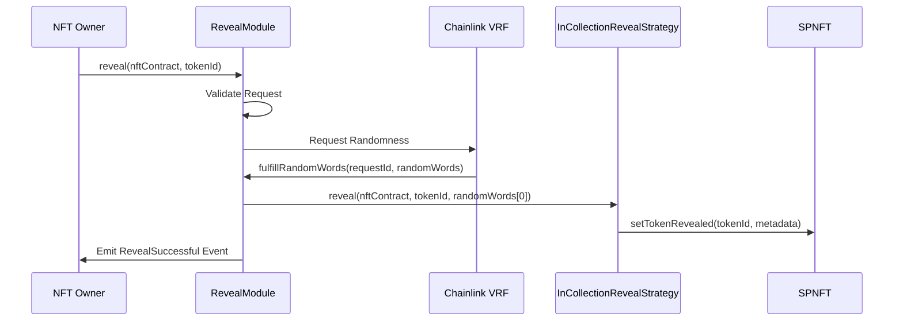
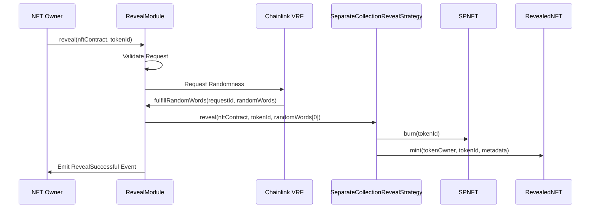

# Reveal Process Architecture

## Overview
This document provides an overview of the architecture and flow of the NFT reveal process. It explains how the `RevealModule` interacts with different components, including the reveal strategies (`InCollectionRevealStrategy` and `SeparateCollectionRevealStrategy`), Chainlink VRF, and NFT contracts (`SPNFT` and `RevealedNFT`). The document also outlines the sequence of calls and events during the reveal process.

---

## Table of Contents
1. [Overview](#overview)
2. [Architecture](#architecture)
3. [Flow of Calls](#flow-of-calls)
    - [InCollectionRevealStrategy](#incollectionrevealstrategy)
    - [SeparateCollectionRevealStrategy](#separatecollectionrevealstrategy)
4. [Key Components](#key-components)
5. [Security Considerations](#security-considerations)
6. [Sequence Diagrams](#sequence-diagrams)

---

## Architecture
The reveal process is designed to securely and efficiently reveal NFTs using randomness provided by Chainlink VRF. The architecture consists of the following key components:

1. **RevealModule**:
   - Manages the reveal process.
   - Validates requests and interacts with Chainlink VRF for randomness.
   - Delegates the reveal logic to a strategy implementing the `IRevealStrategy` interface.

2. **Reveal Strategies**:
   - **InCollectionRevealStrategy**: Updates metadata for NFTs within the same collection.
   - **SeparateCollectionRevealStrategy**: Burns the original NFT and mints a new NFT in a separate collection with revealed metadata.

3. **NFT Contracts**:
   - **SPNFT**: Represents the base NFT collection.
   - **RevealedNFT**: Represents the collection of revealed NFTs.

4. **Chainlink VRF**:
   - Provides secure randomness for the reveal process.

5. **Timelock Controller**:
   - Secures updates to the reveal strategy.

### Flexibility and Extensibility
The architecture is designed to be flexible and extensible, allowing for the seamless integration of new reveal strategies. By adhering to the `IRevealStrategy` interface, developers can implement custom strategies tailored to specific requirements. The `RevealModule` can dynamically switch between strategies using the timelock-protected `scheduleStrategyUpdate` and `executeStrategyUpdate` functions, ensuring governance and security during updates.

This flexibility ensures that the system can evolve to support new use cases, such as:
- Adding strategies for multi-chain NFT reveals.
- Supporting advanced metadata generation techniques.
- Integrating with external systems for enhanced functionality.

---

## Flow of Calls

### 1. **InCollectionRevealStrategy**
The flow for revealing NFTs within the same collection is as follows:

1. **Request Reveal**:
   - The NFT owner calls `RevealModule.reveal(nftContract, tokenId)`.
   - The `RevealModule` validates the request and sends a randomness request to Chainlink VRF.

2. **Randomness Fulfillment**:
   - Chainlink VRF calls `RevealModule.fulfillRandomWords(requestId, randomWords)`.
   - The `RevealModule` retrieves the associated `RevealRequest` and calls `InCollectionRevealStrategy.reveal`.

3. **Metadata Update**:
   - The `InCollectionRevealStrategy` generates metadata using the `MetadataGenerator` library.
   - It updates the metadata of the NFT by calling `SPNFT.setTokenRevealed`.

4. **Completion**:
   - The `RevealModule` marks the NFT as `Revealed` and emits a `RevealSuccessful` event.

---

### 2. **SeparateCollectionRevealStrategy**
The flow for revealing NFTs by burning the existing NFT and minting to a separate collection is as follows:

1. **Request Reveal**:
   - The NFT owner calls `RevealModule.reveal(nftContract, tokenId)`.
   - The `RevealModule` validates the request and sends a randomness request to Chainlink VRF.

2. **Randomness Fulfillment**:
   - Chainlink VRF calls `RevealModule.fulfillRandomWords(requestId, randomWords)`.
   - The `RevealModule` retrieves the associated `RevealRequest` and calls `SeparateCollectionRevealStrategy.reveal`.

3. **Burn and Mint**:
   - The `SeparateCollectionRevealStrategy` burns the original NFT using `SPNFT.burn`.
   - It generates metadata using the `MetadataGenerator` library.
   - It mints a new NFT in the `RevealedNFT` collection with the generated metadata.

4. **Completion**:
   - The `RevealModule` marks the NFT as `Revealed` and emits a `RevealSuccessful` event.

---

## Key Components

### 1. **RevealModule**
- Validates reveal requests.
- Manages the reveal status of NFTs.
- Interacts with Chainlink VRF for randomness.
- Delegates reveal logic to the active strategy.

### 2. **InCollectionRevealStrategy**
- Updates metadata for NFTs within the same collection.
- Uses the `MetadataGenerator` library to generate metadata.

### 3. **SeparateCollectionRevealStrategy**
- Burns the original NFT and mints a new NFT in a separate collection.
- Uses the `MetadataGenerator` library to generate metadata.

### 4. **SPNFT**
- Represents the base NFT collection.
- Supports metadata updates and token burning.

### 5. **RevealedNFT**
- Represents the collection of revealed NFTs.
- Supports minting of new NFTs with revealed metadata.

---

## Security Considerations
- **Access Control**:
  - Only the `RevealModule` can trigger the reveal process in strategies.
  - Only authorized strategies can update metadata or mint revealed NFTs.

- **Randomness Integrity**:
  - Chainlink VRF ensures that randomness is secure and tamper-proof.

- **Timelock Governance**:
  - The `TimelockController` secures updates to the reveal strategy, preventing unauthorized changes.

- **Error Handling**:
  - Custom errors provide clear and gas-efficient failure messages.

---

## Sequence Diagrams

### InCollectionRevealStrategy

---

### SeparateCollectionRevealStrategy

---

## Summary
The reveal process is designed to be modular, secure, and extensible. By leveraging Chainlink VRF for randomness and supporting multiple reveal strategies, the architecture ensures flexibility while maintaining security and transparency.
